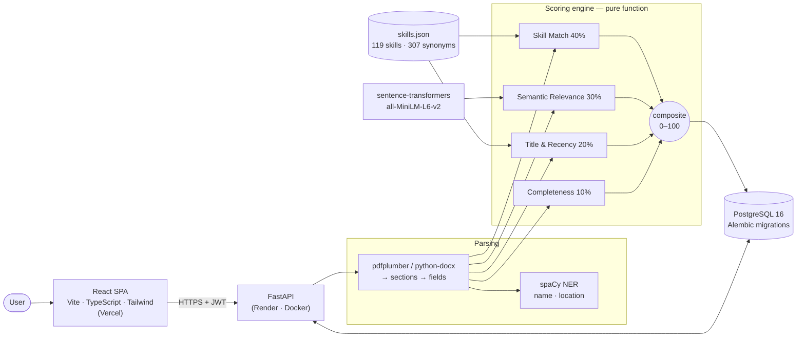

<div align="center">

# ResumeIQ

**An explainable resume ↔ job-description match engine.**
Upload a resume, paste a job posting, and get a 0–100 match score broken into four signals you can actually act on — including the exact skills you're missing.

[](https://github.com/Sidd927/ResumeIQ/actions/workflows/ci.yml)


</div>

---

## ✨ Live demo

> **🔗 [resume-iq-beta-henna.vercel.app](https://resume-iq-beta-henna.vercel.app/)** · API docs: [resumeiq-api-l5mb.onrender.com/docs](https://resumeiq-api-l5mb.onrender.com/docs)
>
> Runs on free hosting: if the API has been idle it takes **~30–60 s to wake up** on the first request (the app tells you when this is happening). After that, a match takes well under a second.

Want your own copy? Both halves deploy from this repo with no code changes — see **Deployment** below.

## 🎯 What it does

Most "resume scanners" either count keywords or ask an LLM for a number and print whatever comes back. ResumeIQ does neither. It **parses** your resume and the job description into structured data, then scores the match with four independent, deterministic signals — so every point is explainable:

- **Which required skills you're missing** — split into _required_ (fix these first) and _nice-to-have_.
- **How well your experience covers what they asked for**, even when you used different words.
- **Whether your most recent role lines up** with the posting — and whether you used the skills recently.
- **Whether the resume itself parsed cleanly**, because a resume an ATS can't read never gets scored at all.

Same resume + same job = same score, every time.

## 🏗️ Architecture



The API only **loads inputs and saves outputs**. All scoring happens inside `compute_match()`, a pure function: no database, no network, no LLM, no clock (today's date is passed in) — which is what makes the scores reproducible and unit-testable.

## 🔬 How scoring works

```
composite = (0.4 × skill + 0.3 × semantic + 0.2 × recency + 0.1 × completeness) × 100
```

| Signal                   | Weight | How it's computed                                                                                                                                                                                                                                                                                                                            |
| ------------------------ | :----: | -------------------------------------------------------------------------------------------------------------------------------------------------------------------------------------------------------------------------------------------------------------------------------------------------------------------------------------------- |
| **Skill Match**          |  40%   | `(2·required matched + 1·preferred matched) / (2·required + 1·preferred)`. Every skill is first normalised through a curated taxonomy — `k8s` = `Kubernetes`, `ML` = `Machine Learning`, `postgres` = `PostgreSQL`.                                                                                                                          |
| **Semantic Relevance**   |  30%   | Each resume bullet and JD requirement is embedded with **all-MiniLM-L6-v2**. For each requirement, take the best-matching bullet's cosine similarity; average those; then **calibrate** (see design decisions).                                                                                                                              |
| **Title & Recency**      |  20%   | Mean of **(a)** title similarity between your _most recent_ role and the posting (role-word overlap, "Developer" ≡ "Engineer", minus 15% per seniority level you're under) and **(b)** recency-weighted skill evidence: each JD skill scores by how recently a role _demonstrates_ it — full credit within 2 years, then a 2-year half-life. |
| **Section Completeness** |  10%   | Name 12.5% · email 12.5% · work history 30% · education 20% · ≥ 3 skills 25%.                                                                                                                                                                                                                                                                |

**Why these weights?** They encode a judgement about how screening actually works, not a fitted model:

- **Skills (40%)** are the first filter recruiters and ATS apply, and they're the most objective signal — so they carry the most weight.
- **Semantic relevance (30%)** catches strong experience described in different words, but embeddings are noisier than an exact skill match, so it weighs less.
- **Title & recency (20%)** is a supporting signal — a close title and recent use of the skills matter, but shouldn't outweigh having them.
- **Completeness (10%)** is hygiene: it should cost you points when the parser couldn't read a section, but formatting should never dominate the score.

The weights live in one constant (`WEIGHTS` in `scorer.py`); tuning them against real recruiter decisions is listed under [future work](#-limitations--future-work).

### A worked example

The sample resume in `backend/tests/fixtures/` vs. a _Senior Full Stack Developer_ posting:

| Signal          | Score | × weight |    Points | Why                                                                      |
| --------------- | ----: | -------: | --------: | ------------------------------------------------------------------------ |
| Skill Match     | 0.667 |      0.4 |     26.67 | 6/8 required + 2/5 preferred → (12 + 2) / 21                             |
| Semantic        | 0.637 |      0.3 |     19.11 | bullets cover the requirements well, except AWS and Node.js              |
| Title & Recency | 0.651 |      0.2 |     13.01 | "Full Stack Developer" vs "**Senior** Full Stack Developer" → 0.85 title |
| Completeness    | 1.000 |      0.1 |     10.00 | every section parsed                                                     |
| **Composite**   |       |          | **68.79** | missing: Node.js, AWS _(required)_; Redis, GraphQL, Kubernetes           |

## 🛠️ Tech stack

| Layer    | Technology                                                                                           |
| -------- | ---------------------------------------------------------------------------------------------------- |
| Frontend | React 18, TypeScript (strict), Vite, Tailwind CSS, axios, React Router                               |
| Backend  | Python 3.11, FastAPI, Pydantic v2, SQLAlchemy 2.0                                                    |
| NLP      | spaCy `en_core_web_sm` (NER), sentence-transformers `all-MiniLM-L6-v2`, pdfplumber, python-docx      |
| Database | PostgreSQL 16, Alembic migrations                                                                    |
| Auth     | JWT access (30 min) + refresh (7 days) tokens, bcrypt                                                |
| Testing  | pytest + coverage, Vitest                                                                            |
| CI       | GitHub Actions — lint, tests, PostgreSQL integration tests, migration drift check, Docker smoke test |
| Deploy   | Vercel (frontend), Render (Docker backend + PostgreSQL)                                              |

## 📊 Testing

| Suite               |   Tests | What it covers                                                                                                           |
| ------------------- | ------: | ------------------------------------------------------------------------------------------------------------------------ |
| Backend unit + API  | **163** | scorer 47 · parser 27 · taxonomy 27 · API flow 21 · auth 21 · production hardening 13 · CORS 5 · health 2                |
| Backend integration |   **3** | against real PostgreSQL: JSONB columns, full API flow, in-process migrations                                             |
| Frontend            |  **60** | API client & token refresh 12 · API layer 8 · mock toggle 3 · JWT & open-redirect guard 18 · score bands & formatting 19 |

- **Backend line coverage: 96%** (`pytest --cov=app`). Semantic tests run the **real** MiniLM model; arithmetic tests use a stub embedder so the formula is checked exactly.
- **Frontend: 88% line coverage of the logic layer** (API client, auth store, helpers). UI components are verified end-to-end in the browser rather than unit-tested.
- **CI** runs all of it on every push, plus `alembic check` (models and migrations can't drift) and a job that **builds the production Docker image and boots it with PostgreSQL under a 512 MB memory cap** — the same limit as Render's free tier.

## 🔒 Production hardening

- **Refuses to start** in production with the default or a short JWT secret, or with SQLite.
- **Rate limiting** on credential endpoints (per IP: 5 logins / 3 registrations per minute) with `Retry-After`.
- **Uploads**: PDF/DOCX only, checked by extension _and_ magic bytes; 5 MB cap enforced from `Content-Length` before the body is read.
- **Security headers** (`nosniff`, `X-Frame-Options: DENY`, `Referrer-Policy`, HSTS in production); CORS restricted to known origins, with no credentialed CORS (tokens travel in headers, not cookies).
- **Ownership**: another user's resources return **404, not 403**, so IDs don't reveal what exists.
- **Structured logs** (`event=match_computed match_id=12 composite=68.79 …`) with user IDs only — never emails, passwords or tokens.
- **Frontend**: `?redirect=` after login only accepts same-site paths (no open redirect); a network error never logs you out.

## 🚀 Local development

**Prerequisites:** Python 3.11+, Node.js 20.19+ (or 22+), and optionally Docker for PostgreSQL.

```bash
git clone https://github.com/Sidd927/ResumeIQ.git && cd ResumeIQ
docker compose up -d db          # optional — the backend also runs on SQLite
```

**Backend** — http://localhost:8000/docs

```bash
cd backend
python3.11 -m venv venv && source venv/bin/activate
pip install -r requirements-dev.txt   # runtime deps + pytest/ruff; includes the pinned spaCy model
cp .env.example .env                  # defaults match docker-compose
alembic upgrade head
uvicorn app.main:app --reload
```

No Docker? Use SQLite instead: `DATABASE_URL=sqlite:///./resumeiq_dev.db uvicorn app.main:app --reload` (tables are created automatically in development). The ~80 MB embedding model downloads on the first match.

**Frontend** — http://localhost:5173

```bash
cd frontend
npm install
cp .env.example .env   # leave VITE_API_URL empty: Vite proxies /api to :8000, so no CORS locally
npm run dev
```

**No backend at all?** `VITE_USE_MOCK=true npm run dev` runs the whole UI on in-browser mock data — handy for demos when the API is asleep.

### Checks

```bash
# backend/
python -m pytest                                                # unit + API tests (SQLite, real models)
python -m pytest --cov=app                                      # with coverage
TEST_POSTGRES_URL=postgresql://… python -m pytest -m integration
ruff check . && ruff format --check .

# frontend/
npm test                                                        # or: npm run test:coverage
npm run typecheck && npm run lint && npm run format:check && npm run build
```

### Try the API in Swagger

Open `/docs` → `POST /api/auth/register` → **Execute** (body pre-filled) → `POST /api/auth/login` → copy `access_token` → **Authorize** → upload `backend/tests/fixtures/sample_resume.pdf` → `POST /api/jobs` (sample JD pre-filled) → `POST /api/match`.

## ☁️ Deployment

Everything needed is in the repo: `render.yaml`, `backend/Dockerfile`, `frontend/vercel.json`.

**1. Backend + database on Render** (free, no credit card)

1. Render dashboard → **New → Blueprint** → connect this repo. Render reads `render.yaml`, creates the PostgreSQL database and builds the Docker image (~10 min the first time).
2. When prompted for `BACKEND_CORS_ORIGINS`, enter your Vercel URL (you can also fill it in after step 2 and redeploy).
3. `JWT_SECRET_KEY` is generated by Render; migrations run automatically on startup.

**2. Frontend on Vercel** (free)

1. Vercel → **Add New → Project** → import this repo → set **Root Directory** to `frontend`.
2. Add the environment variable `VITE_API_URL=https://<your-service>.onrender.com`, then deploy.
3. Put the resulting URL into the Render service's `BACKEND_CORS_ORIGINS`.

**Free-tier realities** (measured, not guessed):

- The API container peaks at **~461 MB of the 512 MB** allowed while serving matches. It fits because the image uses CPU-only PyTorch, one inference thread and a single worker — don't add workers on the free plan.
- The service **sleeps after ~15 min idle**; the frontend pings `/health` on page load and shows a "waking up" message during the 30–60 s cold start.
- **Free Render PostgreSQL databases expire after 30 days** — upgrade or recreate before then.

## 📁 Project structure

```
ResumeIQ/
├── render.yaml                  # Render Blueprint: API service + PostgreSQL
├── docker-compose.yml           # local PostgreSQL
├── .github/workflows/ci.yml     # backend · frontend · docker jobs
├── backend/
│   ├── Dockerfile               # multi-stage, CPU torch, models baked in
│   ├── alembic/                 # migrations (applied at startup in production)
│   ├── app/
│   │   ├── main.py              # app factory: lifespan, middleware, routers
│   │   ├── config.py            # typed settings + production safety checks
│   │   ├── middleware.py        # security headers, upload size guard
│   │   ├── routers/             # auth · resumes · jobs · match · health
│   │   ├── schemas/             # Pydantic request/response contracts
│   │   ├── models/              # SQLAlchemy ORM
│   │   ├── services/
│   │   │   ├── scorer.py        # ★ the scoring engine (pure functions)
│   │   │   ├── parser.py        # PDF/DOCX → structured resume; JD parser
│   │   │   ├── taxonomy.py      # synonym-aware skill matching
│   │   │   ├── embeddings.py    # sentence-transformers wrapper
│   │   │   ├── auth.py          # bcrypt, JWT, current-user dependency
│   │   │   └── rate_limit.py    # sliding-window limiter
│   │   └── data/skills.json     # 119 skills, 307 synonyms
│   └── tests/                   # 166 tests + PDF/DOCX/JD fixtures
└── frontend/
    ├── vercel.json              # SPA rewrites + headers
    └── src/
        ├── api/                 # client.ts (JWT refresh) · api.ts (real) · mockApi.ts · index.ts (toggle)
        ├── stores/authStore.ts  # session derived from the JWTs
        ├── components/          # ScoreBreakdown, MissingSkills, ResumeUpload, …
        ├── pages/               # Landing, Dashboard, History, MatchDetail, Login, Register
        └── types/               # TS contracts mirroring the Pydantic schemas
```

## 🎓 Key design decisions

- **The scoring engine is a pure function.** `compute_match(parsed_resume, parsed_jd, taxonomy, embedder, reference_date)` has no side effects. Even "today" is a parameter — recency depends on the date, so reading the clock inside would make yesterday's score irreproducible.
- **Calibrated semantic scores.** Measured, MiniLM's best-match cosine for a _strong_ developer resume vs. a developer JD is only ~0.47, while unrelated careers (nurse, chef) land at 0.08–0.14. Using raw cosine would cap great matches near 47/100, so the scorer rescales 0.15 → 0 and 0.65 → 1. The embedding service still returns the raw value; calibration lives in the scorer, where it's visible and tested.
- **Ambiguous skills are only trusted in lists.** "Go", "C", "REST" and "Spring" are real skills and everyday words. They match inside a Skills list, but not in prose — otherwise _"go-to person for the rest of the team"_ would count as Go and REST.
- **Sub-scores are rounded before the composite is computed**, so the stored composite always equals the weighted sum of the stored sub-scores.
- **Token refresh with de-duplication.** An expired access token is refreshed before a request goes out; a 401 triggers one refresh and one retry, never a loop; concurrent requests share a single refresh call.
- **Mock/real API behind one interface.** `api.ts` and `mockApi.ts` both implement `ResumeIQApi`, so TypeScript guarantees they can't drift, and `VITE_USE_MOCK=true` is a real fallback for demos.
- **Fits the free tier on purpose.** CPU-only PyTorch, a multi-stage image with the models baked in, one thread and one worker — measured at 461 MB peak against a 512 MB limit.

## 🧭 Limitations & future work

- **Weights and calibration constants are hand-set**, not learned. The next step would be collecting recruiter shortlisting decisions and fitting the weights (e.g. logistic regression over the four sub-scores).
- **Single-column resumes parse best**; multi-column PDFs can interleave text. English only.
- **The rate limiter is in-memory**, which is correct for one instance; scaling out would need Redis.
- **Planned (Phase 5):** Claude-generated feedback written _from_ the structured scores (never computing them), bullet-rewrite suggestions, and a score-trend view across resume versions.

## 📄 License

[MIT](LICENSE) © 2026 Siddhant Patil
