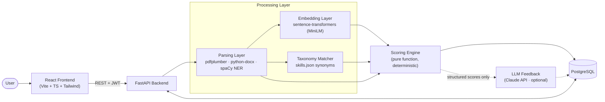

# ResumeIQ

**AI-powered resume ↔ job description matcher that returns an explainable 0–100 score, a 4-signal breakdown, and the exact hard skills you're missing.**


---

## Why it's different

Most "resume scorers" either do naive keyword counting or hand the whole thing to an LLM and print whatever number comes back. ResumeIQ's scoring engine is a **pure, deterministic function** of structured inputs (parsed fields + embeddings + taxonomy hits). Same inputs → same score, and every point is traceable to a sub-score. An LLM is only (optionally) used to turn those structured scores into human-readable feedback — it never computes a score.

## Architecture



## Tech Stack

| Layer    | Technology |
|----------|------------|
| Frontend | React 18, Vite, TypeScript, TailwindCSS, React Router, Recharts, Axios |
| Backend  | Python 3.11+, FastAPI, Pydantic v2, Uvicorn |
| NLP      | pdfplumber, python-docx, spaCy (`en_core_web_sm`), sentence-transformers (`all-MiniLM-L6-v2`), curated skill taxonomy |
| Database | PostgreSQL 16, SQLAlchemy 2.0, Alembic |
| Auth     | JWT (access + refresh), bcrypt |
| Testing  | Pytest, httpx / FastAPI TestClient |
| CI       | GitHub Actions |
| Deploy   | Vercel (frontend) · Render/Railway (backend) · Railway Postgres |

## Getting Started

### Prerequisites

- Python 3.11+
- Node.js 20.19+ or 22+
- Docker (for local Postgres) — optional: the backend also runs on SQLite (`DATABASE_URL=sqlite:///./resumeiq_dev.db`)

### 1. Clone & configure

```bash
git clone <repo-url> resumeiq && cd resumeiq
cp .env.example backend/.env
```

### 2. Database (optional for now)

```bash
docker compose up -d db
```

### 3. Backend

```bash
cd backend
python3.11 -m venv venv
source venv/bin/activate
pip install -r requirements.txt   # includes the pinned spaCy model wheel
alembic upgrade head              # needs the database running
uvicorn app.main:app --reload     # → http://localhost:8000/docs
```

The sentence-transformer model (~80 MB) downloads to the HuggingFace cache on the first match request (or at boot with `PRELOAD_MODELS=true`).

Run the tests — no database required (SQLite in-memory), real NLP models:

```bash
python -m pytest -v                                             # unit + API tests
TEST_POSTGRES_URL=postgresql://… python -m pytest -m integration  # PostgreSQL-only tests
```

#### Try the API in Swagger (`/docs`)

1. `POST /api/auth/register` → **Try it out** → **Execute** (the demo body is pre-filled)
2. `POST /api/auth/login` → **Execute** → copy `access_token`
3. Click **Authorize** (top right), paste the token
4. `POST /api/resumes` → upload any PDF/DOCX (e.g. `backend/tests/fixtures/sample_resume.pdf`)
5. `POST /api/jobs` → **Execute** (a sample JD is pre-filled)
6. `POST /api/match` with the two IDs → 4 sub-scores, composite, missing skills

### 4. Frontend

```bash
cd frontend
npm install
npm run dev                   # → http://localhost:5173 (backend must be running on :8000)
```

In dev the app calls relative `/api/...` URLs and Vite proxies them to FastAPI, so CORS never applies locally. For a production build set `VITE_API_URL` to the backend origin and add the frontend's URL to the backend's `BACKEND_CORS_ORIGINS`.

**Demo without a backend:** `VITE_USE_MOCK=true npm run dev` swaps in in-browser mock data (any email/password logs in).

Checks: `npm run typecheck` · `npm run lint` · `npm test` · `npm run build`

#### How auth works in the browser

- Login stores the JWT pair in `localStorage`; the auth store decodes the access token's payload (never verifying it — that's the server's job) to know who is logged in, so a page refresh keeps you signed in without a `/me` call.
- The API client attaches `Authorization: Bearer …`, refreshes an expired access token *before* sending, and on a 401 refreshes and retries **once**. Concurrent requests share one refresh.
- If the refresh token is rejected, the session ends: tokens are cleared, you're sent to `/login?redirect=<page>` and told why. A network error never logs you out.

## Project Structure

```
resumeiq/
├── CLAUDE.md                  # project source of truth
├── README.md
├── docker-compose.yml         # local Postgres
├── .env.example
├── .github/workflows/ci.yml   # pytest + typecheck on every push
├── backend/
│   ├── requirements.txt
│   ├── alembic.ini
│   ├── alembic/               # migrations (env.py reads DATABASE_URL from app config)
│   ├── app/
│   │   ├── main.py            # FastAPI app + CORS + router mounts
│   │   ├── config.py          # Pydantic Settings (env vars)
│   │   ├── database.py        # SQLAlchemy engine + session
│   │   ├── models/            # user, resume, job, match
│   │   ├── schemas/           # Pydantic request/response contracts
│   │   ├── routers/           # health, auth, resumes, jobs, match
│   │   ├── services/
│   │   │   ├── parser.py      # PDF/DOCX → structured JSON
│   │   │   ├── scorer.py      # the scoring engine (pure function)
│   │   │   ├── embeddings.py  # sentence-transformers wrapper
│   │   │   └── taxonomy.py    # skill synonym matcher
│   │   └── data/skills.json   # curated skill taxonomy
│   └── tests/
└── frontend/
    ├── package.json
    └── src/
        ├── api/               # client.ts (axios + JWT refresh), api.ts (real), mockApi.ts, index.ts (toggle)
        ├── components/
        ├── stores/            # authStore — JWT-derived session state
        ├── hooks/
        ├── pages/
        └── types/             # TS interfaces mirroring backend schemas
```

## API Endpoints

| Method | Path                       | Body                        | Returns |
|--------|----------------------------|-----------------------------|---------|
| POST   | `/api/auth/register`       | `{ email, password }`       | `{ user }` |
| POST   | `/api/auth/login`          | `{ email, password }`       | `{ access_token, refresh_token }` |
| POST   | `/api/auth/refresh`        | `{ refresh_token }`         | `{ access_token }` |
| POST   | `/api/resumes`             | multipart file (PDF/DOCX)   | `{ resume_id, parsed_json }` |
| GET    | `/api/resumes/{id}`        | —                           | stored resume + parsed JSON |
| POST   | `/api/jobs`                | `{ raw_text }`              | `{ job_id, parsed_json }` |
| GET    | `/api/jobs/{id}`           | —                           | stored JD + parsed JSON |
| POST   | `/api/match`               | `{ resume_id, job_id }`     | match result with 4 sub-scores |
| GET    | `/api/match/{id}`          | —                           | match result |
| GET    | `/api/match/history`       | —                           | list of match results |
| POST   | `/api/match/{id}/feedback` | —                           | *(stretch)* LLM feedback text |

Plus `GET /health` for liveness. Interactive docs at `/docs` (Swagger) and `/redoc`.
All `/api/*` routes except register/login/refresh need `Authorization: Bearer <access_token>`; resources belonging to other users return 404.

## Scoring Algorithm

```
composite = (0.4 × skill + 0.3 × semantic + 0.2 × recency + 0.1 × completeness) × 100
```

| Signal | Weight | How it's computed | Explains |
|--------|:------:|-------------------|----------|
| **Skill Match** | 40% | `(2·required matched + 1·preferred matched) / (2·required + 1·preferred)`, every skill normalised through the taxonomy first (`k8s` = `Kubernetes`, `ML` = `Machine Learning`) | Missing skills, required first |
| **Semantic Relevance** | 30% | For each JD requirement line, the best cosine similarity against any resume bullet (all-MiniLM-L6-v2); averaged, then linearly calibrated so 0.15 → 0 and 0.65 → 1 | Which requirements your experience covers |
| **Title & Recency** | 20% | Mean of (a) most-recent title vs. JD title — role-word overlap × seniority factor (−15% per level under) and (b) recency-weighted skill evidence — each JD skill scores the recency of the latest role that shows it (full within 2 years, then a 2-year half-life) | Whether relevant experience is current |
| **Section Completeness** | 10% | name 12.5% + email 12.5% + work history 30% + education 20% + ≥3 skills 25% | Which sections the parser could not read |

Each sub-score is in `[0, 1]` and implemented as an independently unit-tested function in `backend/app/services/scorer.py`. `compute_match` is a **pure function**: no database, no I/O, no LLM, and "today" is passed in explicitly — so the same inputs always produce the same scores.

## Roadmap

- [x] **Phase 0** — Scaffold, CI, migrations
- [x] **Phase 1** — Frontend shell with mock data
- [x] **Phase 2** — Parsing + scoring engine + API
- [x] **Phase 3** — Wire frontend ↔ backend, auth, DB
- [ ] **Phase 4** — Deploy, coverage, polish
- [ ] **Phase 5** — Stretch: Claude feedback, bullet rewriting, trend dashboard

## License

MIT
